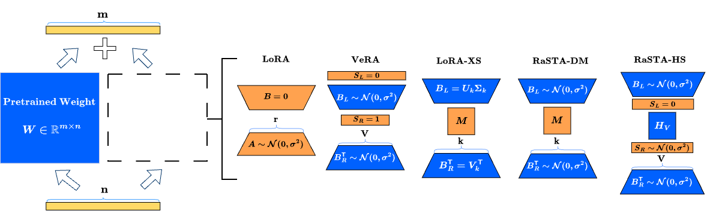
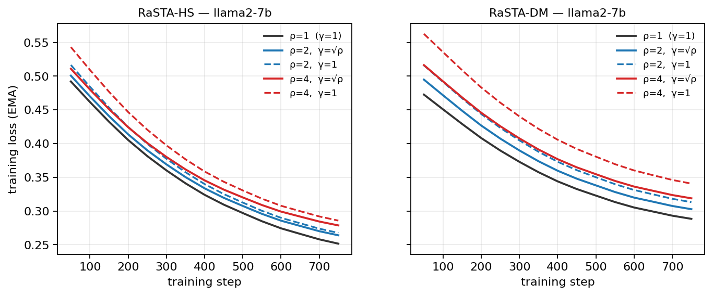
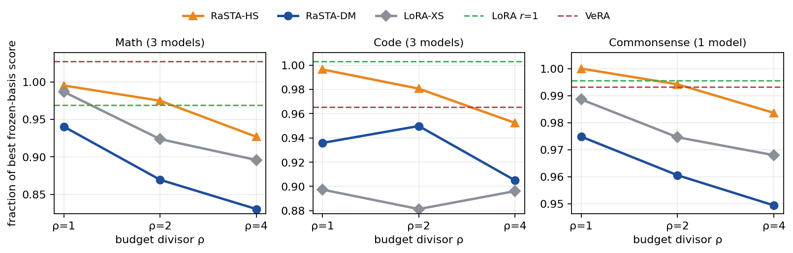
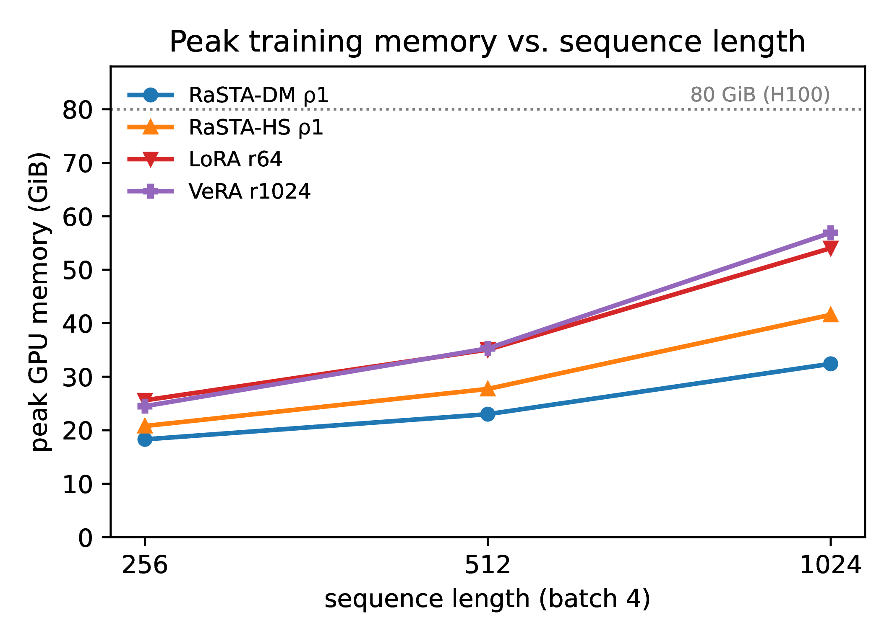
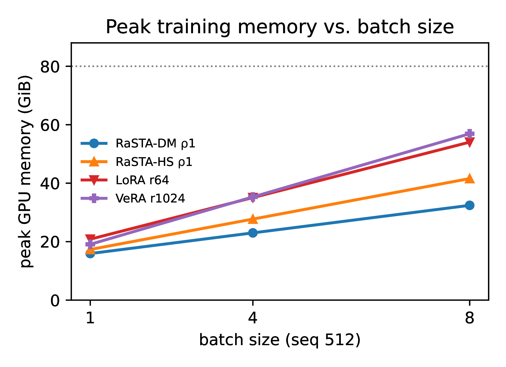
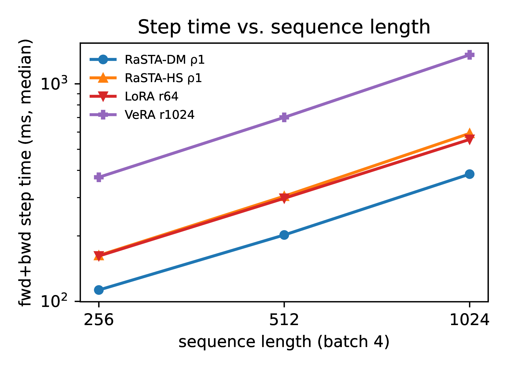

# RaSTA: Random Subspace Tuning Adaptation

Official implementation of **RaSTA** (**Ra**ndom **S**ubspace **T**uning **A**daptation), a
parameter-efficient fine-tuning method that adapts a frozen weight by **learning how to mix
directions inside fixed random subspaces**, rather than learning the subspaces themselves.
The left and right subspaces are spanned by frozen random bases shared across layers; only a
small mixing core between them is trained, and its size is set independently of the layer's
dimensions.

> **RaSTA: Random Subspace Tuning Adaptation** — [paper link TBD]

**What is specific to RaSTA**

- **Learned mixing inside shared random subspaces.** RaSTA combines the mixing-core structure of
  LoRA-XS with the shared frozen random bases of VeRA. No per-weight SVD is needed, and the bases
  are regenerated from seeds, so an adapter checkpoint holds only the learned core.
- **A Walsh–Hadamard mixing core (RaSTA-HS).** A fixed Hadamard matrix couples every left basis
  direction with every right one, and only two scaling vectors around it are learned. This lets
  a tiny budget reach many more directions than a dense learned core. To our knowledge this is
  the first use of the Walsh–Hadamard transform inside the mixing core of a frozen-basis adapter.
- **A size-aware budget decoupled from layer width.** One hyperparameter `ρ` gives each
  `m×n` weight about `√(mn)/ρ` trainable parameters, instead of the `r(m+n)` that LoRA ties to
  the layer's dimensions.
- **Budget-stabilized update scaling.** Setting `γ = √ρ` keeps optimization comparable across
  budgets, so one learning rate per variant works at every `ρ`.

---

## Method

<p align="center">
  
</p>
<p align="center"><em>
How each method factorizes the additive update to a frozen weight W (m×n).
Frozen components in blue, trainable in orange.
</em></p>

### General form

For a frozen pretrained weight $`W \in \mathbb{R}^{m \times n}`$, RaSTA learns the additive update

```math
\Delta W = \gamma B_L \tilde{M} B_R^{\top}
```

- $`B_L \in \mathbb{R}^{m \times k}`$ and $`B_R \in \mathbb{R}^{n \times k}`$ are **frozen random
  Gaussian bases** with unit-norm columns. They fix the left and right directions the update can
  use, and are shared by all layers with the same basis shape.
- $`\tilde{M}`$ is the **mixing core**. Entry $`\tilde{M}_{ij}`$ weights the outer product of the
  $`i`$-th left and the $`j`$-th right basis vector, so the core decides how the available
  directions interact.
- $`\gamma`$ is a fixed update scale (see [Update scaling](#update-scaling)).

LoRA learns the row and column spaces of its update. RaSTA keeps those spaces fixed and random
and learns only the combination of directions inside them. The two RaSTA variants differ in how
the core spends its parameter budget.

### How the methods differ structurally

| Method | Update $`\Delta W`$ | Learned | Frozen bases | Core structure | Params per matrix |
|---|---|---|---|---|---|
| LoRA | $`BA`$ | $`B, A`$ | none (factors are learned) | none | $`r(m+n)`$ |
| VeRA | $`\mathrm{diag}(s_L) B_L \mathrm{diag}(s_R) B_R^{\top}`$ | $`s_L, s_R`$ | shared random | diagonal: direction $`i`$ pairs only with direction $`i`$ | $`m + V`$ |
| LoRA-XS | $`B_L M B_R^{\top}`$ | $`M`$ | per-weight truncated SVD | dense, fully learned | $`k^2`$ |
| RaSTA-DM | $`\gamma B_L M B_R^{\top}`$ | $`M`$ | shared random | dense, fully learned | $`k^2`$ |
| **RaSTA-HS** | $`\gamma B_L \mathrm{diag}(s_L) H_V \mathrm{diag}(s_R) B_R^{\top}`$ | $`s_L, s_R`$ | shared random | dense, fixed Hadamard coupling with learned scalings | $`2V`$ |

The frozen-basis methods can be read as points on one axis: how the core couples left and right
directions. VeRA's core is diagonal. RaSTA-HS keeps a dense but fixed coupling and learns only
per-direction scalings. RaSTA-DM and LoRA-XS learn every coupling. RaSTA-DM and LoRA-XS share the
same structure and differ only in the bases; they perform comparably on average in our
experiments, which suggests that spectral bases are not necessary for this family.

### The Walsh–Hadamard matrix

The normalized Walsh–Hadamard matrix of power-of-two order is built by the Sylvester recursion

```math
H_{2n} = \frac{1}{\sqrt{2}} \begin{pmatrix} H_n & H_n \\ H_n & -H_n \end{pmatrix}
```

starting from $`H_1 = [1]`$. Every entry is $`\pm 1/\sqrt{n}`$, and its rows are mutually
orthogonal, so $`H_n H_n^{\top} = I_n`$. Because of the recursive structure, multiplying by
$`H_n`$ (the Walsh–Hadamard transform) takes $`O(n \log n)`$ operations with the fast
Walsh–Hadamard transform, and the matrix never has to be stored.

These properties are why RaSTA-HS uses it as the fixed factor of its core:

- **Equal-magnitude entries** mean every left–right direction pair is coupled with the same
  strength before the learned scalings act, so no pair is privileged by the fixed factor.
- **Orthogonal rows** mean the mixed directions are equally weighted and none is a linear
  combination of the others.
- **A fast implicit transform** gives dense mixing with no stored matrix, no extra trainable
  parameters, and near-linear cost in $`V`$.

### RaSTA-HS: Hadamard scaling

```math
\tilde{M} = \mathrm{diag}(s_L) H_V \mathrm{diag}(s_R)
```

Only the two scaling vectors $`s_L, s_R \in \mathbb{R}^{V}`$ are learned, which is $`2V`$
parameters for $`V`$ directions per side. Each core entry is
$`\tilde{M}_{ij} = s_{L,i} (H_V)_{ij} s_{R,j}`$: the Hadamard matrix supplies the pattern of
interactions, and the scalings control how much each left and right direction contributes.

Because the learned part grows only linearly in $`V`$, RaSTA-HS can afford a much wider subspace
than a dense core at the same budget. Since $`H_V`$ is full-rank, the core itself is full-rank
whenever the scalings are nonzero, so the update is not limited to a handful of directions.

At initialization $`s_L = 0`$ and the entries of $`s_R`$ are drawn from
$`\mathcal{N}(0, 0.01^2)`$, so $`\Delta W = 0`$ at the start of training.

### RaSTA-DM: dense mixing

```math
\tilde{M} = M \in \mathbb{R}^{k \times k}
```

Every entry of the core is learned, which is $`k^2`$ parameters for $`k`$ directions per side,
with $`M`$ initialized to zero. This gives unrestricted pairwise interactions, but among far fewer
directions.

### Expressivity versus coverage

At a matched budget $`k^2 \approx 2V`$, the two variants make opposite choices. RaSTA-DM spends
the budget on **expressivity**: free mixing among $`k`$ directions. RaSTA-HS spends it on
**coverage**: structured mixing across $`V`$ directions, with $`V`$ much larger than $`k`$. For a
4096×4096 layer at `ρ = 2`, nearly the same budget buys either free mixing among 45 directions
(RaSTA-DM, 2025 parameters) or Hadamard-structured mixing across 1024 directions (RaSTA-HS,
2048 parameters).

### Size-aware budget

Since the basis widths are not tied to the layer's dimensions, a single compression
hyperparameter `ρ` sets them. Each $`m \times n`$ weight gets a target budget of
$`\sqrt{mn}/\rho`$, which allocates more parameters to larger layers in proportion to the
geometric mean of their dimensions. The widths are

```math
k = \left\lfloor \sqrt{\frac{\sqrt{mn}}{\rho}} \right\rfloor
```

```math
V = \min\left( 2^{\mathrm{round}\left(\log_2 \frac{\sqrt{mn}}{2\rho}\right)}, 2^{\lfloor \log_2 \min(m, n) \rfloor} \right)
```

so that $`k^2 \approx 2V \approx \sqrt{mn}/\rho`$. $`V`$ is rounded to a power of two, as the
Hadamard matrix requires, and capped so the directions cannot outnumber the layer's rank. Larger
`ρ` gives a smaller adapter. At `ρ = 1` the budget is $`\sqrt{mn} \le (m+n)/2`$, at most half of
rank-one LoRA.

### Update scaling

Increasing `ρ` shrinks the budget and also the magnitude of the unscaled update. RaSTA sets
$`\gamma = \sqrt{\rho}`$ for both variants to compensate, analogous in spirit to rank-stabilized
LoRA, so a single learning rate per variant can be used at every budget. With the scaling, loss
curves at different budgets become near-parallel. Without it, smaller budgets train visibly
slower, and RaSTA-DM is more sensitive than RaSTA-HS:

<p align="center">
  
</p>
<p align="center"><em>
Training loss (EMA) for RaSTA-HS (left) and RaSTA-DM (right) at ρ ∈ {1, 2, 4}, with γ = √ρ
(solid) and without (dashed). ρ = 1 is identical in both cases.
</em></p>

### Basis construction and sharing

Each basis is sampled with i.i.d. $`\mathcal{N}(0, 1)`$ entries and column-normalized,
deterministically from a seed key that encodes the basis side, the input or output dimension,
and the basis width. Every layer that needs the same basis shape uses the same basis. Each layer
stores only its learned core ($`M`$ or $`s_L, s_R`$) plus the seed keys, and the bases are
regenerated, and verified by hash, when the adapter is reloaded or merged into $`W`$.

---

## Results

We evaluate on mathematical reasoning, commonsense reasoning, code generation, and GLUE, using
Llama-2-7B, Mistral-7B, Llama-3-8B, and RoBERTa-large. The budgets range from under half of
rank-one LoRA's parameters down to roughly a tenth. Across this range, both variants stay
competitive with low-rank LoRA and degrade gracefully as the budget shrinks.

<p align="center">
  
</p>
<p align="center"><em>
Fraction of the best frozen-basis score each method retains at each budget, normalized within
each (model, task) cell and averaged over models. Dashed lines: LoRA r = 1 and VeRA.
</em></p>

RaSTA-HS is the strongest frozen-basis method at every budget, and its curve is the flattest as
`ρ` grows. Its `ρ = 2` configuration matches or exceeds RaSTA-DM and LoRA-XS at `ρ = 1`, with
roughly half the parameters. The dense-mixing methods are the most budget-sensitive. The full
per-model and per-dataset tables are in the paper.

---

## Efficiency

RaSTA's cost profile follows from its structure:

- **Optimizer state scales with the budget, not the layer.** Gradients and AdamW states exist
  only for the core, whose size is about $`\sqrt{mn}/\rho`$ per matrix rather than $`r(m+n)`$.
- **Frozen bases are stored once per shape.** Sharing means one copy of each basis serves every
  layer of that shape, and none of it enters the checkpoint.
- **RaSTA-DM's adapter path is narrow.** Inputs are projected to only $`k`$ directions, so the
  step cost is dominated by the frozen base model and stays nearly flat in `ρ`.
- **RaSTA-HS's cost scales with $`V`$.** The projection and the $`O(V \log V)`$ transform grow
  with the subspace width, so raising `ρ` directly lowers its step time and memory. A fused CUDA
  kernel applies the transform in a single launch.

In our profiling, both variants train with lower peak memory than LoRA and VeRA, and the gap
widens with sequence length and batch size.

<p align="center">
  
  
  
</p>
<p align="center"><em>
Peak memory vs. sequence length, peak memory vs. batch size, and step time vs. sequence length
for a single training step (measured on Mistral-7B; the full grid across backbones is in the
paper's appendix).
</em></p>

---

## Repository layout

```
.
├── rasta.py                  # RaSTA implementation (both variants, save/merge utilities)
├── utils/
│   ├── train_rasta.py        # trainer for RaSTA-DM / RaSTA-HS
│   ├── train_loraxs.py       # trainer for LoRA-XS (within RaSTA's budget/scaling framework)
│   ├── train_lora.py         # trainer for LoRA
│   ├── train_vera.py         # trainer for VeRA
│   └── ...                   # shared training/eval utilities
├── Math/                     # math task: data module + GSM8K/MATH evaluation
├── Code/                     # code task: data module + HumanEval/MBPP (EvalPlus) evaluation
├── Commonsense/              # commonsense task: data module + 8-dataset evaluation
├── Glue/                     # GLUE: train_glue.py (RoBERTa-large, train+eval in one stage)
├── assets/                   # figures used in this README
├── run_math.sh               # single-run driver: train + eval, one method/model/config
├── run_code.sh
├── run_commonsense.sh
├── run_glue.sh
└── requirements.txt
```

## Installation

```bash
git clone <repo-url> && cd <repo>
pip install -r requirements.txt
```

Main dependencies: PyTorch (bf16-capable GPU recommended), `transformers`, `datasets`,
`peft >= 0.10` (VeRA support), and `evalplus` (code evaluation only).

**Optional but recommended for RaSTA-HS:**

```bash
pip install fast-hadamard-transform
```

This enables the fused Walsh–Hadamard CUDA kernel (up to ~2× faster whole-model steps for
RaSTA-HS). Without it, RaSTA-HS **automatically falls back** to a pure-PyTorch butterfly
implementation — identical results, slower. The kernel is self-checked against the reference
implementation at first use.

## Quick start

RaSTA wraps the target `nn.Linear` layers of any model in place. You train the core parameters
with a standard optimizer, save only those parameters, and later rebuild the adapter from seeds
and merge it back into plain `nn.Linear` layers.

### 1. Apply the adapter

```python
import torch
from transformers import AutoModelForCausalLM
from rasta import apply_rasta

model = AutoModelForCausalLM.from_pretrained(
    "mistralai/Mistral-7B-v0.1", torch_dtype=torch.bfloat16
).cuda()

target = ["q_proj", "k_proj", "v_proj", "o_proj", "gate_proj", "up_proj", "down_proj"]
model = apply_rasta(
    model,
    rho=1.0,              # budget: ~sqrt(m*n)/rho trainable params per adapted matrix
    variant="hs",         # "hs" = Hadamard scaling, "dm" = dense mixing
    target_modules=target,
)
```

`apply_rasta` replaces each matching layer with a RaSTA adapter, freezes every other parameter,
and prints the per-layer width and trainable count. The update scale `γ = √ρ` is applied
automatically. For RaSTA-HS it also checks the fused Walsh–Hadamard kernel on first use and falls
back to the PyTorch implementation if the kernel is missing.

### 2. Train

Only the cores (`s_L`, `s_R` for RaSTA-HS, `M` for RaSTA-DM) require gradients, so any standard
training loop or the Hugging Face `Trainer` works unchanged:

```python
trainable = [p for p in model.parameters() if p.requires_grad]
optimizer = torch.optim.AdamW(trainable, lr=3e-2, weight_decay=0.01)  # RaSTA-HS lr from the paper

model.train()
for batch in dataloader:  # your tokenized batches with input_ids, attention_mask, labels
    loss = model(**batch).loss
    loss.backward()
    optimizer.step()
    optimizer.zero_grad()
```

Base weights stay in bf16 and the trainable cores in fp32 by default (`frozen_dtype`,
`trainable_dtype`). The paper's learning rates are listed under
[Reproducing the paper](#reproducing-the-paper).

### 3. Save the adapter

```python
from rasta import save_rasta_adapter

save_rasta_adapter(model, "my_adapter/", target_modules=target, rho=1.0, variant="hs")
```

This writes `adapter_weights.pt`, which holds only the learned cores, and `rasta_config.json`,
which holds the configuration and a hash of every frozen basis. The bases themselves are not
saved.

### 4. Reload and merge

```python
from rasta import load_and_merge_rasta

base = AutoModelForCausalLM.from_pretrained(
    "mistralai/Mistral-7B-v0.1", torch_dtype=torch.bfloat16
).cuda()
merged = load_and_merge_rasta(base, "my_adapter/")
merged.save_pretrained("my_merged_model/")
```

`load_and_merge_rasta` regenerates the bases from their seeds, checks them against the saved
hashes, loads the cores, folds `ΔW` into each weight, and returns the model with plain
`nn.Linear` layers.

## Running the paper's experiments

Each task has a single self-contained driver that trains, merges, and evaluates one
method/model/config:

```bash
bash run_<task>.sh <method> <model> <config> [lr] [seed]
```

```bash
# RaSTA-HS at rho=1 on Mistral-7B, math (train on MetaMathQA, eval GSM8K + MATH)
bash run_math.sh rasta-hs mistralai/Mistral-7B-v0.1 rho1

# RaSTA-DM at rho=2 on Llama-3-8B, code (train on CodeFeedback, eval HumanEval + MBPP)
bash run_code.sh rasta-dm meta-llama/Meta-Llama-3-8B rho2

# LoRA r=8 baseline on Llama-2-7B, math
bash run_math.sh lora meta-llama/Llama-2-7b-hf r8

# Commonsense (Llama-3-8B)
bash run_commonsense.sh rasta-hs meta-llama/Meta-Llama-3-8B rho1

# GLUE (RoBERTa-large): bash run_glue.sh <task> <method> <config>
bash run_glue.sh rte rasta-hs rho1
```

- `method` ∈ `rasta-hs | rasta-dm | lora-xs | lora | vera`
- `config` is `rho<value>` for rasta-hs / rasta-dm / lora-xs, and `r<value>` for lora / vera
  (for VeRA, `r<value>` sets the basis width V, e.g. `r1024`)
- `lr` defaults to the per-method value used in the paper (see below); `seed` defaults to 42
- Results land in `results/<run_name>/eval_results.json`

Hardware knobs are environment variables: `N_GPUS` (default 2, via `torchrun`), `GLOBAL_BATCH`
(default 128), `PER_DEVICE_BATCH` (default 8; use 4 for RaSTA-HS on 7–8B models). Gradient
accumulation is derived automatically. The paper's runs fit on a single H100-80GB.

To reproduce the ablation without update scaling, or to use one basis width for every layer,
`apply_rasta` also accepts `update_scale` and `fixed_V`.

## Reproducing the paper

**Grid.** All main results are single runs at seed 42. Instruction tuning uses models
`{Llama-2-7B, Mistral-7B, Llama-3-8B}` (commonsense: Llama-3-8B only); GLUE uses RoBERTa-large.

| Method | Instruction tuning | GLUE |
|---|---|---|
| RaSTA-HS / RaSTA-DM / LoRA-XS | ρ ∈ {1, 2, 4} | ρ ∈ {1, 2, 4} |
| LoRA (α = 2r) | r ∈ {1, 8, 64} | r ∈ {1, 2, 8} |
| VeRA | V = 1024 | V = 256 |

LoRA-XS uses the same per-layer allocation and update scale as RaSTA-DM, so the two differ only
in their frozen bases.

**Learning rates** (fixed per method across models and budgets; the scripts' defaults):

| Method | Math / Code | Commonsense / GLUE |
|---|---|---|
| RaSTA-HS | 3e-2 | 2e-2 |
| RaSTA-DM | 4e-3 | 2e-3 |
| LoRA-XS | 4e-3 | 2e-3 |
| LoRA | 2e-4 | 2e-4 |
| VeRA | 2e-2 | 2e-2 |

**Protocol.**

- *Instruction tuning:* adapters on all attention + MLP linear projections; 1 epoch, effective
  batch 128, AdamW, cosine schedule with 0.03 warmup, bf16 base weights with fp32 trainable
  parameters, Alpaca prompt format, greedy decoding at evaluation.
- *GLUE:* adapters on query/value projections of RoBERTa-large; fp32, sequence length 128,
  batch 32, AdamW with a linear schedule and 0.06 warmup. The classification head trains in
  every run at a fixed lr of 5e-4. `train_glue.py` evaluates the dev set each epoch and reports
  the best-epoch metric (per-task epoch counts are set by its defaults).
- RaSTA and LoRA-XS use `γ = √ρ` throughout.

To reproduce a full table, loop the driver over the grid, e.g.:

```bash
for model in mistralai/Mistral-7B-v0.1 meta-llama/Llama-2-7b-hf meta-llama/Meta-Llama-3-8B; do
  for cfg in rho1 rho2 rho4; do
    bash run_math.sh rasta-hs "$model" "$cfg"
  done
done
```

### Data

| Task | Train | Eval | Setup |
|---|---|---|---|
| Math | MetaMathQA (100k samples) | GSM8K, MATH | auto-downloaded from the HF Hub |
| Code | CodeFeedback python split (via `fxmeng/pissa-dataset`) | HumanEval, MBPP via EvalPlus | auto-downloaded; `pip install evalplus` |
| Commonsense | Commonsense-170K | BoolQ, PIQA, SIQA, HellaSwag, WinoGrande, ARC-e, ARC-c, OBQA | included in the repo under `Commonsense/data/commonsense/` |
| GLUE | per-task GLUE train sets | per-task dev sets | auto-downloaded via `datasets` |

## Citation

```bibtex
@article{rasta2026,
  title  = {RaSTA: Random Subspace Tuning Adaptation},
  author = {TBD},
  year   = {2026}
}
```
